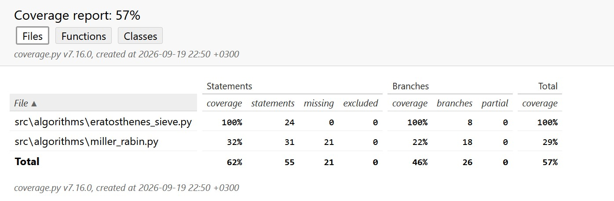

# Testaus

## Algoritmien testaus

### Eratostheneen seula

Eratostheneen seula on yksikkötestattu TestErathosthenesSieve-luokalla. Luokka testaa, että get_primes_list-metodi paluttaa alkuluvut listassa ja tarkistaa, että alkuluvut ovat oikein tapauksissa, joissa ne on laskettu lukuihin 2, 11 ja 100 asti. Lisäksi ohjelmaa on ajettu komentoriviltä, jossa olen syöttänyt luvun, johon asti haluan luoda alkulukuja, jolloin ohjelma on tulostanut syöttämääni lukua pienemmät alkuluvut ja syöttämäni luvun, jos se oli alkuluku. Listat ovat olleet vielä pieniä. Suurin syöte on ollut 100, jonka olen tarkistanut.

### Miller-Rabin

Miller-Rabin-algoritmiä on testattu TestMillerRabin-luokalla osittain.

## Testikattavuus

