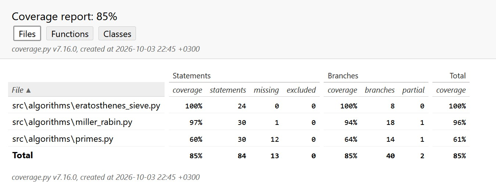

# Testaus

## Algoritmien testaus

### Eratostheneen seula

Eratostheneen seula on yksikkötestattu TestErathosthenesSieve-luokalla. Luokka testaa, että get_primes_list-metodi paluttaa alkuluvut listassa ja tarkistaa, että alkuluvut ovat oikein tapauksissa, joissa ne on laskettu lukuihin 2, 11 ja 100 asti. Lisäksi ohjelmaa on ajettu komentoriviltä, jossa olen syöttänyt luvun, johon asti haluan luoda alkulukuja, jolloin ohjelma on tulostanut syöttämääni lukua pienemmät alkuluvut ja syöttämäni luvun, jos se oli alkuluku. Listat ovat olleet vielä pieniä. Suurin syöte on ollut 100, jonka olen tarkistanut.

### Miller-Rabin

Miller-Rabin-algoritmiä on testattu TestMillerRabin-luokalla. Algoritimiä on testattu kahdeksan, kymmenen, 38 100, 290 ja 300 -yksikköisillä tunnetuilla alkuluvuilla ja niiden tuloista saaduilla yhdistetyillä luvuilla. Lisäksi sitä on testattu luvuilla yksi, kaksi, kolme sekä negatiivisella luvulla. Koska kyseiselle Miller-Rabinille annetaan alaraja, jotta se ei testaisi Eratostheneen seulan lukuja on algoritmiä testattu alarajalla, joka on suurempi kuin alkulukuehdokas - 2. Tällöin algoritmi asettaa uudeksi alarajaksi luvun kaksi, jolloin se edelleen toimii.

## Alkulukujen luonti

### PrimesGenerator-luokka

PrimesGenerator-luokkaa on testattu luokalla TestPrimesGenerator, joka testaa metodia is_prime kolme, neljä, kahdeksan, kymmenen, 35 100, 290 ja 300 -yksikköisillä tunnetuilla alkuluvuilla ja niiden tuloista saaduilla yhdistetyillä luvuilla sekä ääriarvolla 2.

## Testikattavuus

